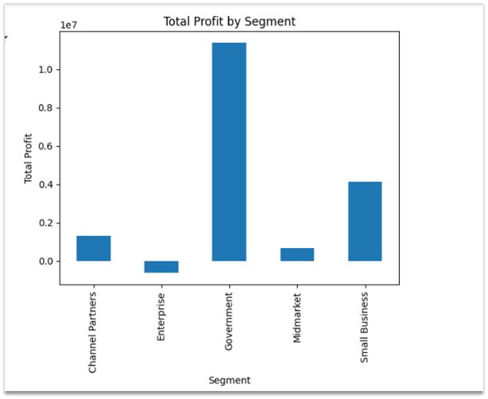
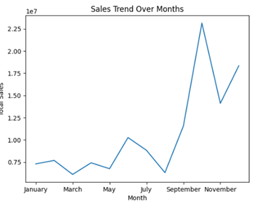
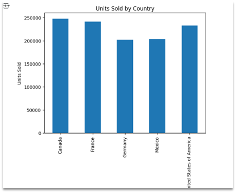
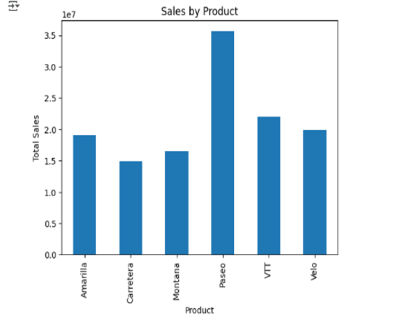
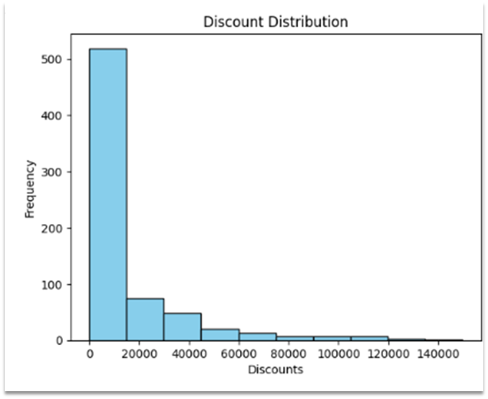

# 📊 Python Analysis and Code – Global Financial Dataset Summary

This analysis is based on a dataset containing financial data of products across different countries and segments. The goal is to derive business insights and visualize performance trends using Python.

---

## 1. 📦 Import Libraries and Load Data

```python
import pandas as pd
import matplotlib.pyplot as plt
import seaborn as sns

file_xls = 'Financial Sample.xlsx'
data = pd.read_excel(file_xls)
```

- Libraries used: `pandas`, `matplotlib`, and `seaborn`
- The dataset is loaded and previewed using `.describe()` to understand its structure.

---

## 2. 💰 Segment Profitability Analysis

**Question**: Which segment generated the highest total profit?

```python
profit_by_segment = data.groupby('Segment')['Profit'].sum()
profit_by_segment.plot(kind='bar', title='Total Profit by Segment')
```

- A bar chart shows the total profit by segment.
- Insight: The visualization clearly identifies the most profitable segment.
---
  
---
- This section provides a visual analysis of the **Total Profit by Segment** to understand which business segments contribute the most to overall profitability.
## 📊 Key Observations

1. **Government Segment**:
   - Stands out as the **most profitable** by a large margin.
   - Total profit is well above **10 million**, significantly outperforming all other segments.

2. **Small Business**:
   - The **second most profitable** segment.
   - Contributes a strong portion of the overall profit, though far behind the Government sector.

3. **Channel Partners**:
   - Moderate profitability, contributing a **smaller but healthy share** of total profits.

4. **Midmarket** and **Enterprise**:
   - **Lowest performing** segments in terms of profit.
   - May require strategic evaluation—either due to higher costs or lower revenue generation.

## 🔍 Insights

- The **Government sector** appears to be a **core revenue driver**, suggesting a strong foothold or effective strategies in that area.
- **Small Businesses** also present good potential, possibly due to volume or targeted offerings.
- **Enterprise and Midmarket** segments may need reevaluation for optimization or support.
---

## 3. 📈 Sales Trend Over Months

```python
monthly_sale = data.groupby('Month Name')['Gross Sales'].sum()
month_order = ['January', 'February', 'March', 'April', 'May', 'June', 
               'July', 'August', 'September', 'October', 'November', 'December']
monthly_sales = monthly_sale.reindex(month_order)
monthly_sales.plot(kind='line', title='Sales Trend Over Months')
```
 📈 Visualization Summary: Sales Trend Over Months
- This line chart titled "Sales Trend Over Months" displays the total sales across each month of the year.
---

---
🔍 Key Observations:
-January to August: Sales remained relatively steady with minor fluctuations, staying below 10 million.
- September: There was a sharp increase, indicating a strong surge in sales.
- October: Sales peaked dramatically, reaching the highest point, over 22.5 million.
- November: There was a drop, but sales remained significantly higher than most earlier months.
- December (if missing): Either not available or excluded from the dataset.

📊 Insights:
- The significant growth from August to October could indicate:
- A seasonal demand (e.g., holidays, back-to-school, or promotional events).
- A successful marketing campaign or product launch.
- Monitoring and planning around the September–October period could optimize business strategy
---

## 4. 🌍 Top Performing Country by Units Sold

**Question**: Which country sold the most units overall?

```python
units_by_country = data.groupby('Country')['Units Sold'].sum()
units_by_country.plot(kind='bar', title='Units Sold by Country')
```

- Bar chart reveals the country with the highest sales volume.
- Insight: Enables targeted regional strategies.
---

---
This bar chart shows the Units Sold by Country, highlighting sales distribution across five countries.

🗺️ Countries:
- Canada – Highest units sold, slightly above 250,000.
- France – Very close to Canada, just under 250,000.
- Germany – Moderate performance with around 200,000 units.
- Mexico – Similar to Germany, also around 200,000 units.
- United States of America – Slightly higher than Germany and Mexico, but below Canada and France.

📌 Key Insights:
- Top Performers: Canada and France are leading in terms of unit sales.
- Mid-tier Markets: The USA, Germany, and Mexico show decent performance but may have room for growth compared to Canada and France.
- Strategic Opportunity: Focused marketing or distribution improvements in Germany, Mexico, and the USA could potentially boost unit sales.

## 5. 🛍️ Compare Sales Across Products

**Question**: How do sales compare across different products?

```python
sales_by_product = data.groupby('Product')['Gross Sales'].sum()
sales_by_product.plot(kind='bar', title='Sales by Product')
```
- The bar chart titled "Sales by Product" provides a visual comparison of total sales for different product categories. 
- Visualization compares total sales per product.
- Insight: Identifies top and underperforming products.
---


🧾 Explanation of the Visualization:
- X-axis (Horizontal): Represents the different products: Amarilla, Carretera, Montana, Paseo, VTT, and Velo.
- Y-axis (Vertical): Indicates the total sales in scientific notation (e.g., 1e7 = 10 million).
- Bars: The height of each bar corresponds to the total revenue generated by each product.

📊 Key Insights:
- Paseo is the top-selling product with the highest total sales, reaching over 35 million.
- VTT also performs well, with sales exceeding 22 million.
- Carretera has the lowest sales among the listed products, slightly above 15 million.
- The other products (Amarilla, Montana, Velo) have relatively balanced performance, each contributing between 18 and 20 million in sales.

- ✅ Conclusion:
This visualization clearly shows that Paseo is the most lucrative product in the lineup. If you're looking to focus marketing efforts or inventory planning, Paseo and VTT could be your best bets based on past sales performance.
---

## 6. 🎁 Explore Discount Distribution

**Question**: What is the distribution of discounts provided?

```python
plt.hist(data['Discounts'], bins=10, color='skyblue', edgecolor='black')
plt.title('Discount Distribution')
plt.xlabel('Discounts')
plt.ylabel('Frequency')
plt.show()
```

- Histogram highlights frequency and range of applied discounts.
- Insight: Most transactions received minimal or no discounts, suggesting potential for pricing strategy.
---

---
- The bar chart titled “Discount Distribution” is a histogram that shows how discounts are distributed across different ranges.

🧾 Explanation of the Visualization:
- X-axis (Discounts): Represents the range of discount amounts.
- Y-axis (Frequency): Indicates how many times discounts within that range occurred.

- Each bar represents a bin of discount values and shows the number of transactions or instances falling into that bin.

📊 Key Observations:
- The majority of discounts fall into the lowest range (0 to around 20,000), with over 500 occurrences.
- As the discount amount increases, the frequency drops sharply.
- There are very few high-value discounts above 80,000, with nearly negligible frequency beyond 120,000.

✅ Conclusion:
- This is a right-skewed distribution (also known as a long-tail distribution).
- Most customers or transactions receive small to moderate discounts, while large discounts are rare.
- The data suggests a conservative discounting strategy, possibly to maintain profitability while offering minor incentives.
- This visualization is helpful for understanding discount trends and outliers and can guide strategies on pricing, promotions, and revenue management.

## 💡 Recommandation for Business

Based on insights:
- Focus on expanding in the **top-performing country**.
- Promote **best-selling products** more aggressively.
- Consider offering discounts strategically to boost underperforming areas.

